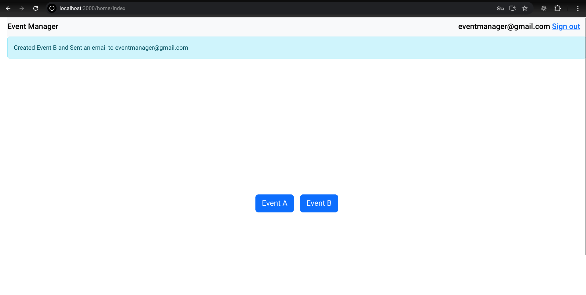

# Event Manager Application

Creates an event on Iterable.com whenever `Event A` or `Event B` is clicked. Send an email when `Event B` is clicked.



Responses of APIs:
```
Started POST "/events" for ::1 at 2024-09-22 02:02:42 +0530
Processing by EventsController#create as TURBO_STREAM
  Parameters: {"authenticity_token"=>"[FILTERED]", "event_type"=>"A", "commit"=>"Event A"}
I, [2024-09-22T02:02:42.445289 #9182]  INFO -- request: POST https://api.iterable.com/api/events/track
I, [2024-09-22T02:02:42.445351 #9182]  INFO -- request: Content-Type: "application/json"
User-Agent: "Faraday v2.12.0"
x-api-key: "mockAPIKey"
I, [2024-09-22T02:02:43.677549 #9182]  INFO -- response: Status 401
I, [2024-09-22T02:02:43.677800 #9182]  INFO -- response: date: "Sat, 21 Sep 2024 20:32:43 GMT"
Completed 200 OK in 1257ms (Views: 1.0ms | ActiveRecord: 0.0ms (0 queries, 0 cached) | GC: 11.8ms)


Started POST "/events" for ::1 at 2024-09-22 02:02:46 +0530
Processing by EventsController#create as TURBO_STREAM
  Parameters: {"authenticity_token"=>"[FILTERED]", "event_type"=>"B", "commit"=>"Event B"}
I, [2024-09-22T02:02:46.933239 #9182]  INFO -- request: POST https://api.iterable.com/api/events/track
I, [2024-09-22T02:02:46.933410 #9182]  INFO -- request: Content-Type: "application/json"
User-Agent: "Faraday v2.12.0"
x-api-key: "mockAPIKey"
I, [2024-09-22T02:02:48.072271 #9182]  INFO -- response: Status 401
I, [2024-09-22T02:02:48.072446 #9182]  INFO -- response: date: "Sat, 21 Sep 2024 20:32:47 GMT"
I, [2024-09-22T02:02:48.073738 #9182]  INFO -- request: POST https://api.iterable.com/api/email/target
I, [2024-09-22T02:02:48.073918 #9182]  INFO -- request: Content-Type: "application/json"
User-Agent: "Faraday v2.12.0"
x-api-key: "mockAPIKey"
I, [2024-09-22T02:02:49.191116 #9182]  INFO -- response: Status 401
I, [2024-09-22T02:02:49.191301 #9182]  INFO -- response: date: "Sat, 21 Sep 2024 20:32:49 GMT"
Completed 200 OK in 2263ms (Views: 0.6ms | ActiveRecord: 0.0ms (0 queries, 0 cached) | GC: 0.5ms)
```
